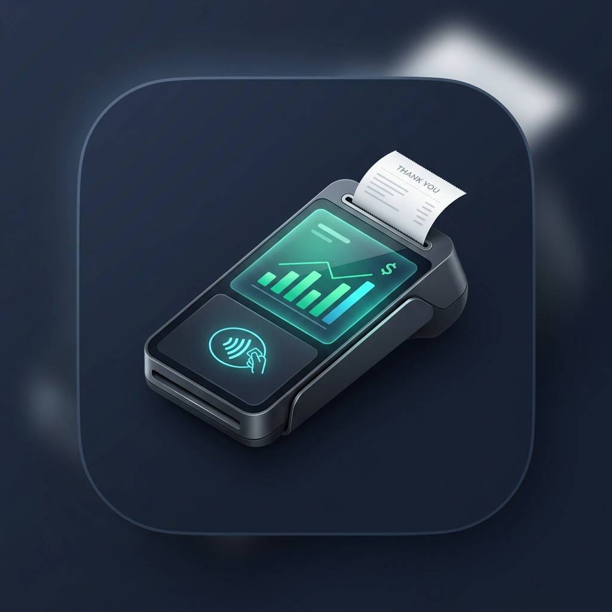
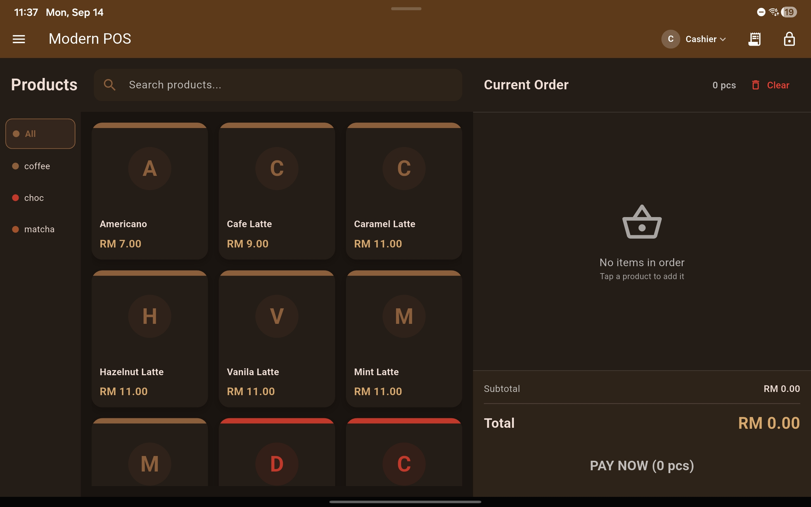
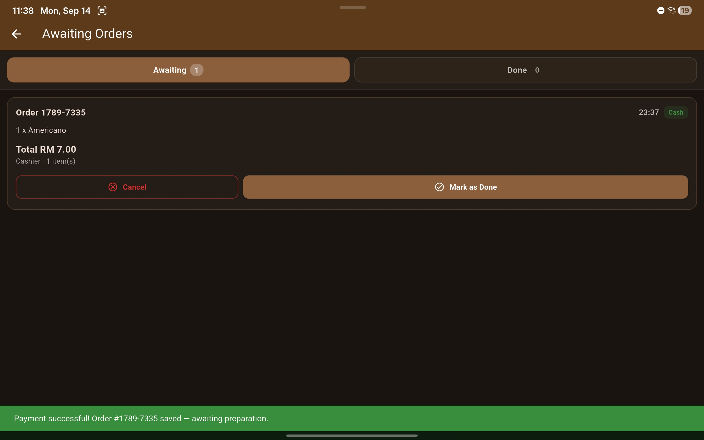
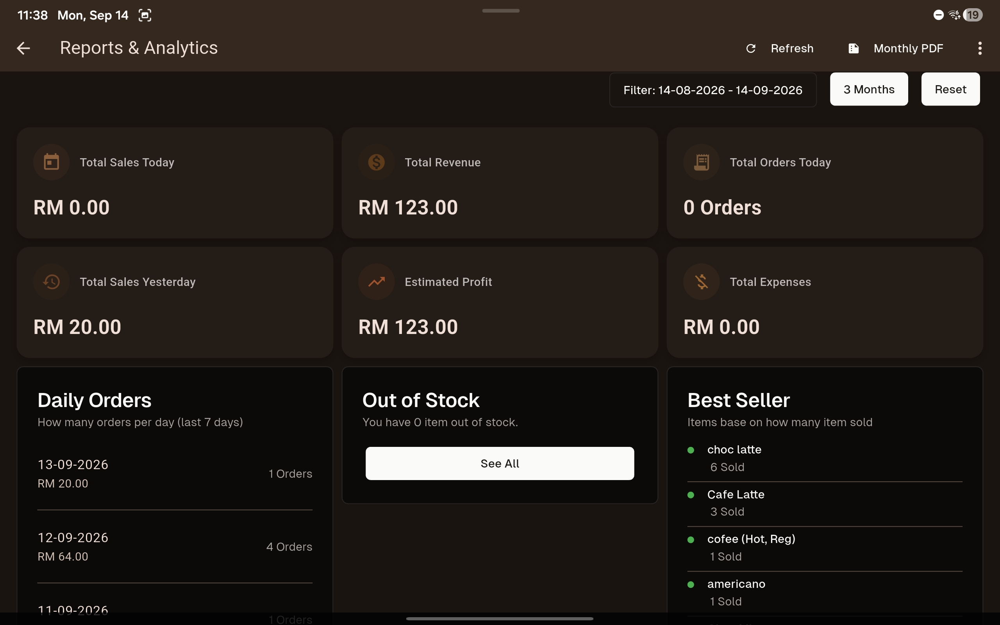
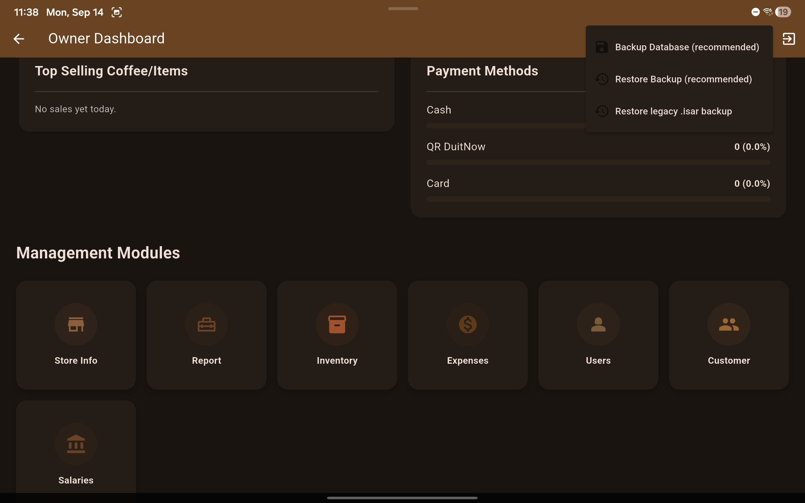
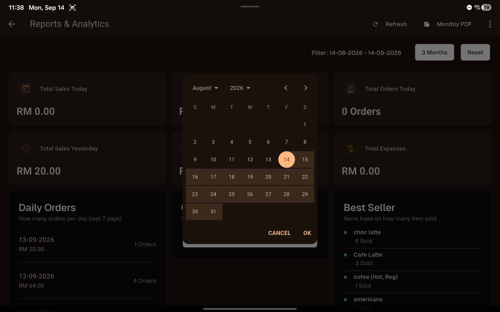

<div align="center">
  
  
  # POS (Point of Sale)

  **A modern, offline-first Point of Sale (POS) & Store Management application built with Flutter.**

  [](https://flutter.dev)
  [](https://dart.dev)
  []()
  []()
  [-success)]()
  [](LICENSE)

  <br />

</div>

---

## 📌 Overview

**POS** is an open-source, enterprise-ready Point of Sale and retail management system designed with an **offline-first architecture** and a streamlined **Modern POS** user interface. Engineered for retail stores, cafes, and rental businesses, it facilitates rapid checkout, barcode scanning, ESC/POS thermal printing, granular expense tracking with receipt photo storage, cash drawer balancing, and cloud synchronization (Supabase).

The application features full **Dark Mode** support, tablet and desktop responsive layouts, and is configured out of the box for the **Malaysian Ringgit (`RM`)** with sen precision.

---

## 📸 Screenshots

| | |
|---|---|
|  |  |
| *Modern POS — catalog, cart & instant payment* | *Awaiting Orders — fulfillment queue & order lifecycle* |
|  |  |
| *Reports & Analytics — drawer balancing & revenue charts* | *Owner Dashboard — JSON & Isar database backup* |

<p align="center">
  <br/>
  <i>Monthly Report — automated paginated PDF export with daily breakdown</i>
</p>

---

## ✨ Key Features

### 🛒 1. Modern POS & Checkout Flow
- **Fast Cart & Order Processing**: Quick product additions, barcode scanning, item discounts, order-level discounts, and subtotal calculation.
- **Awaiting Orders Queue**: Paid orders enter an active fulfillment queue — staff tap **Mark as Done** when delivered, or **Cancel** to void the order (line items automatically return to inventory).
- **Thermal Receipt Printing**: Native ESC/POS thermal printing over Bluetooth and USB (Android & Windows).
- **Cash Drawer Integration**: Automated cash drawer kick-out pulses upon completing cash sales.
- **Worker PIN Quick Sign-In**: Multi-staff PIN picker ("Who's working?") for seamless shift transitions.

### 💰 2. Enhanced Expenses System
- **Store & Merchant Tracking**: Record where items or supplies were purchased (e.g., *Lotus's*, *NSK*, *MR DIY*, *Shopee*).
- **Categorized Accounting**: Classify expenditures into operational categories:
  - *Ingredients & Raw Materials*
  - *Packaging & Containers*
  - *Utilities & Bills*
  - *Equipment & Maintenance*
  - *Staff Meals & Refreshments*
  - *Custom categories*
- **Sen-Precise Ringgit Amounts**: Support for exact decimal entries (e.g., `RM 32.50`) with auto-formatted currency display.
- **Receipt / Invoice Photo Attachments**: Attach bill and receipt photos directly via device camera or file picker; images are stored safely in local application storage.
- **Interactive Receipt Inspection**: Tap any expense card or table row to view full details, accompanied by an interactive, full-screen zoomable preview of the receipt photo.

### 📊 3. Analytics, Reporting & Cash Drawer Balancing
- **Payment Method Drawer Balancing**: Real-time sales breakdown card grouping fulfilled orders by payment method (*Cash, Card, QR, Bank Transfer*) displaying total count and total revenue.
- **Date Range Presets**: One-tap date filters (*Today, This Week, This Month, Last 30 Days, Last 3 Months*) alongside an interactive custom date range calendar.
- **Continuous Multi-Month Revenue Trends**: Interactive charts that correctly map daily revenue and expense trajectories across multiple calendar months without date wrap-around bugs.
- **Accurate Net Profit**: Computes true net profit by deducting verified expenses and cost of goods sold (COGS) from gross fulfilled revenue.

### 📄 4. PDF Generation & Formal Documents
- **Monthly Financial Reports**: Multi-page PDF generator with automatic page-overflow splitting (`pw.MultiPage`). Features:
  - Header with business details, active month period, and generation timestamp.
  - KPI summary metrics (Gross Revenue, Orders Fulfilled, Operating Expenses, Net Profit).
  - Payment method distribution and Top Best Sellers.
  - Structured **Daily Breakdown Table** (`Date`, `Gross Revenue`, `Fulfilled Orders`, `Total Expenses`, `Net Profit`).
- **Formal Invoicing / Receipt PDF**: Sen-precise receipt generation with pre-discount item subtotals, explicit line-item discount indicators, total discount savings, and tax calculations.
- **Payroll & Payslips**: Salary breakdown with basic salary, custom allowances, and deduction vouchers.

### 📦 5. Inventory & Stock Control
- **Full Inventory Lifecycle**: Create, edit, monitor, and delete products and variants.
- **Real-Time Barcode Scanning**: Continuous barcode listening and camera scanner support.
- **Low Stock & Out-of-Stock Warnings**: Visual badges alert staff before stock runs out.
- **CSV Data Import & Export**: Bulk import catalog items from CSV and export stock inventory snapshots.

### 🔄 6. Offline-First Database & Cloud Sync
- **Isar Embedded Database**: Ultra-fast, ACID-compliant local database providing zero-latency offline operations.
- **Portable JSON Backup (`.posbackup`)**: One-click database export to portable, encrypted JSON format that restores atomically in a single transaction without requiring app restart.
- **Legacy `.isar` Migration Safety**: Validate-before-swap integrity checking protects live data from corrupt or version-mismatched files.
- **Supabase Cloud Sync**: Optional two-way synchronization to Supabase cloud backends.

### 🎨 7. Modern Visual Identity & App Icon
- **High-Resolution 3D Icon**: Custom-crafted isometric smart POS terminal badge with glowing touchscreen metrics, live sales graphs, and a contactless payment wave.
- **Cross-Platform Launcher Automation**: Automated build configurations generating native launcher icons across Android (`mipmap-*`), Windows desktop (`.ico`), Web (`favicon.png` & web manifest), and iOS.

---

## 🛠️ Tech Stack

| Layer | Technologies |
|---|---|
| **Framework** | [Flutter](https://flutter.dev/) (Channel Stable, Flutter 3.24+) |
| **Language** | [Dart](https://dart.dev/) 3.3+ |
| **Local Database** | [Isar Database](https://isar.dev/) (v3.1.0) |
| **Cloud Backend** | [Supabase Flutter](https://supabase.com/) |
| **State Management** | [Signals for Flutter](https://pub.dev/packages/signals) |
| **UI Components** | [Shadcn UI](https://shadcn-ui.com/), [Lucide Icons](https://lucide.dev/) |
| **Data Visualization** | [FL Chart](https://pub.dev/packages/fl_chart) |
| **Document Generation** | [PDF](https://pub.dev/packages/pdf), [Printing](https://pub.dev/packages/printing) |
| **Hardware / POS** | `usb_esc_printer_windows`, `print_bluetooth_thermal`, `esc_pos_utils` |
| **Asset Automation** | `flutter_launcher_icons` |

---

## 📂 Directory Structure

```text
lib/
├── db/               # Local Isar database providers & backup services
├── model/            # Data models (Order, Item, Expenses, Customer, Payroll)
├── pages/            # Feature screens
│   ├── expenses/     # Expense listing, form dialogs, receipt zoom viewer
│   ├── order/        # POS order checkout, awaiting queue, invoice details
│   ├── report/       # Analytics dashboards, payment drawer balancing, charts
│   ├── customer/     # Customer management & purchase history
│   ├── payroll/      # Staff salaries, bonus/deduction line items, payslips
│   └── settings/     # Hardware printers, cloud sync, database backup/restore
├── signals/          # Reactive Signals state managers
├── utils/            # Currency formatters, date helpers, theme configurations
└── widget/           # Reusable widgets, PDF receipt & monthly report builders
```

---

## 🚀 Getting Started

### Prerequisites

- **Flutter SDK**: `>= 3.24.0` (Dart `>= 3.3.0`)
- **Java Development Kit**: OpenJDK 21 or Android Studio JBR
- **Android Studio** / **Visual Studio** (for C++ Windows desktop builds)

### Installation

1. **Clone the repository**:
   ```bash
   git clone https://github.com/Shan0h/Pos.git
   cd Pos
   ```

2. **Install Flutter dependencies**:
   ```bash
   flutter pub get
   ```

3. **Generate Code & Database Schemas**:
   ```bash
   dart run build_runner build --delete-conflicting-outputs
   ```

4. **Generate Launcher Icons (Android, Windows, Web)**:
   ```bash
   dart run flutter_launcher_icons
   ```

5. **Run Development Server**:
   ```bash
   # Run on connected Android device or Windows Desktop
   flutter run
   ```

---

## 📦 Building for Production

### Android (APK)
```bash
flutter build apk --release
```
The resulting APK will be saved at:
`build/app/outputs/flutter-apk/app-release.apk`

### Windows (Desktop Executable)
```bash
flutter build windows --release
```
The standalone executable bundle will be located at:
`build/windows/x64/runner/Release/`

---

## 👥 Authors & Acknowledgments

- **Original Author**: [Luthfi](https://github.com/hifiaz) • [LinkedIn](https://linkedin.com/in/luthfiazhari)
- **Maintainer & Contributor**: [Shan0h](https://github.com/Shan0h) • [LinkedIn](https://linkedin.com/in/akmalfauzi34)

---

## 📄 License

This project is licensed under the terms of the **MIT License**. See the [LICENSE](LICENSE) file for details.
